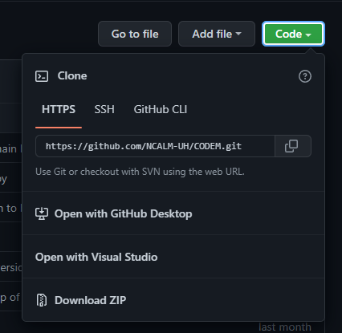
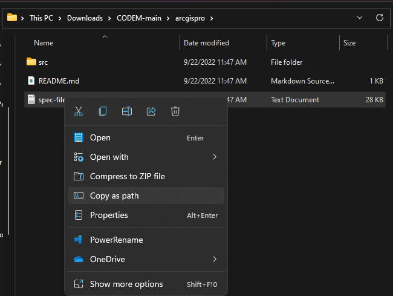
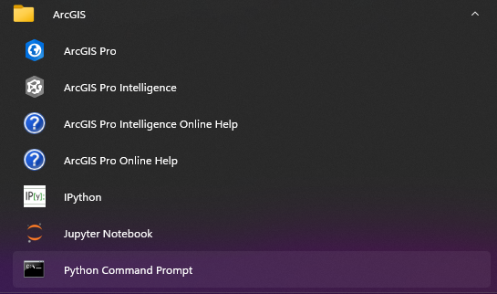
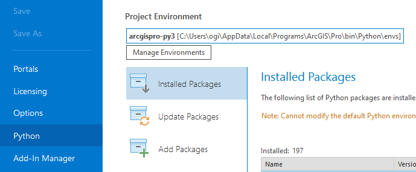
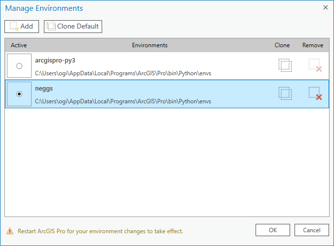
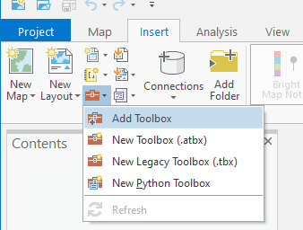
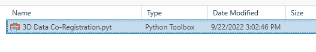
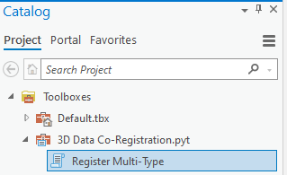

# CODEM ArcGIS Pro Integration

The CODEM package can be used within ArcGIS Pro 2.9 through the use of the [toolbox](./3D%20Data%20Co-Registration.pyt).

To utilize this capability, a conda environment much be created that ArcGIS will read in, and have all the necessary dependencies installed with.

## Installation

See TL;DR section below for shorter summary

### Detailed Steps

To add the codem package to the ArcGIS toolbox, there are a number of steps to be performed.

1. Download the codem repository to your local machine

    
1. Unzip the directory in a location of your choosing.
1. Browse to the `CODEM-main\arcgispro` directory, select the spec-file of choice and select "Copy as path" (On Windows 10, you may need to hold SHIFT while right clicking)

    
1. Launch the ArcGIS Python Command Prompt

    
1. Enter the following command, where the argument to `--file` is the file-path copied in the previous step.  This command will have significant console output, and may contain warnings and some errors, that is okay.  Upon completion, close the command prompt.

    ```doscon
    (arcgispro-py3) C:\Users\ogi\AppData\Local\Programs\ArcGIS\Pro\bin\Python\envs\arcgispro-py3>conda create \
    --name neggs \
    --file "C:\Users\ogi\Downloads\CODEM-main\arcgispro\spec-file.txt"
    ```

1. Open ArcGIS Pro, go to the Python tab

    
1. Press the "Manage Environment" button and then select the newly created `neggs` environment, and select OK.

    
1. Close ArcGIS, and Open the Python Command Prompt again, and run the following command, where the path is the location of the CODEM download from the beginning

    ```doscon
    (neggs) C:\Users\ogi\AppData\Local\Programs\ArcGIS\Pro\bin\Python\envs\neggs>pip install --use-feature=in-tree-build \
    "C:\Users\ogi\Downloads\CODEM-main"
    ```

1. Launch ArcGIS Pro, open the desired project, and Insert a Toolbox

    
1. Browse to the `3D Data Co-Registration.pyt` file that is in the same directory as the spec-file from earlier.

    
1. The Toolbox is now available in the toolbox catalog

    

### TL;DR

Use the following steps if you are familiar with creating conda environment and managing them within ArcGIS.

From the root of the of the CODEM project

```doscon
> conda create --name codem --file .\arcgispro\spec-file-arcgis-29.txt
> conda activate codem
> pip install -e .
```

Within ArcGIS, go to the Python tab, and add a newly created conda environment (this can be retrieved by running `conda info | findstr /c:"active env location"` from the command prompt with the `codem` environment activated).

## Creation of specfile Guide (Advanced)

The following section is directed towards the maintainers of codem.  The author recognizes that the following is not a "best practice" in creating python environments, but it is the only functional steps

While going through the process, some things you absolutely do not want to change

* Never upgrade the ESRI python interpreter, if a conda/mamba resolver wants to upgrade the python version, cancel and attempt to install or upgrade the relative packages without doing that.
* Never upgrade the ESRI numpy version; for ArcGIS Pro 2.9.x, it should be 1.20.1 from the `esri` channel
* SciPy should come from the `defaults` channel.

1. `conda create -n codem -c esri python==3.7.11` and then `conda activate codem`
2. Add `pinned` file to `conda-meta` directory with the following contents:

    ```
    esri::python ==3.7.11
    esri::numpy ==1.20.1
    jinja ==2.11.3
    proj ==9.0.1
    ```
3. `mamba install -c esri -c defaults numpy==1.20.1`
4. `mamba install jinja2=2.11.3`
5. `mamba install -c esri -c defaults arcpy arcgispro`
6. `mamba install libzlib lerc=3.0=h0e60522_0 freetype==2.12.1=h546665d_0`
7. `mamba install -c conda-forge -c defaults proj=9.0.0 vtk=9.2.2`
    need to get libtiff from defaults channel not conda-forge
8. `mamba install pdal python-pdal`
9. `mamba install https://anaconda.org/conda-forge/pyproj/3.2.1/download/win-64/pyproj-3.2.1-py37h560fb97_6.tar.bz2`
    does not want to install with proj > 9.0.0 so we force it
9. `mamba install -c conda-forge -c defaults -c esri rasterio trimesh scikit-image rich`
10. `mamba install -c fastai opencv-python-headless`
11. `mamba upgrade setuptools pip`
12. `conda list --explicit > specfile.txt`


### Problematic Packages

```
esri::lerc  # pdal cannot find lerc.dll
esri::freetype   # pdal cannot find zlib1.dll
jinja2 >= 3.0   # esri's ancient jupyter stuff depends on jinja2 2.x
proj >= 9.1.0   # proj 9.1
```

### Needed Packages

```
conda-forge::libzlib
conda-forge::zlib
conda-forge::lerc ==3.0
main::scipy == 1.6.2
```
