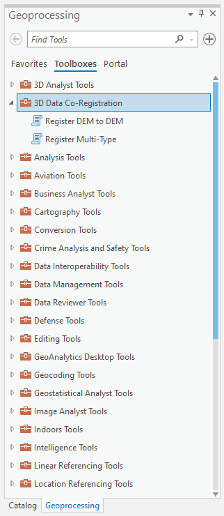

# "Permanent" ArcGIS Pro Toolbox Install

* This directory contains the files necessary to permanently add the `3D Data Co-Registration` toolbox to the set of available ArcGIS Pro Geoprocessing toolboxes (see Fig. 1).
* See the below Reference list for how to generate and distribute the necessary files.
* If desired, the files in the `coregister/esri/toolboxes` directory can still be used to manually import the toolbox.

    

    **Fig. 1 - 3D Registration toolbox permanently installed.**

## References

1. [Online ESRI documentation for creating geoprocessing modules](https://pro.arcgis.com/en/pro-app/latest/arcpy/geoprocessing_and_python/extending-geoprocessing-through-python-modules.htm)
2. [Online ESRI documentation for distributing geoprocessing modules](https://pro.arcgis.com/en/pro-app/latest/arcpy/geoprocessing_and_python/distributing-python-modules.htm)

## Notes

1. You need to choose how to distribute the module. You can either copy the files as they exist (first option in reference \#2) or build a wheel with `setup.py` and use `pip` (second option in reference \#2) to install it into the Conda environment.
2. You should regenerate the files (see reference \#1) in this directory if any of the toolbox files (`*.pyt*` files) are changed.
