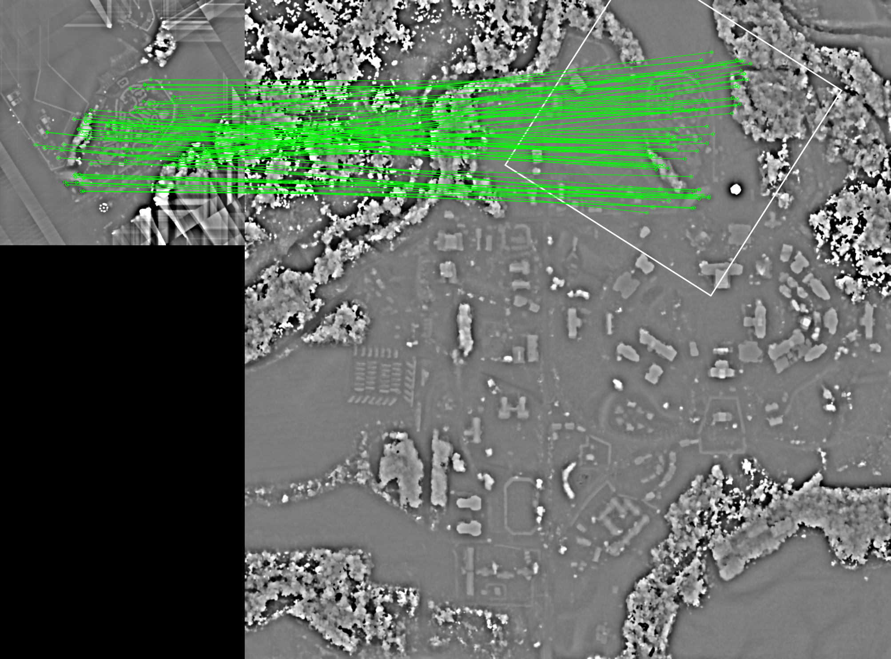

# Detailed Overview
`MODEM` (Multi-Modal Digital Elevation Model Registration) is a spatial data co-registration tool developed in Python.


## Concept
Conceptually, `MODEM` consists of two back-to-back registration modules:
1. An initial coarse global registration based on matched features extracted from digital surface models (DSMs) generated from the AOI and Foundation data sources.
2. A fine local registration based on an iterative closest point (ICP) algorithm applied to the AOI and Foundation data.

Each registration module solves a 6- or 7-parameter similarity transformation (three translations, three rotations, one optional scale). The modules are subject to an overall "pipeline resolution" that controls the density of the data flowing through the pipeline. Foundation and AOI data will likely have different densities, and one or both may contain very high data densities, e.g., point clouds with tens to hundreds of points per square meter. In the case of differing data densities, registration accuracy is limited by the lower density data. Thus, the higher density data is resampled to match that of the lower density data for efficiency. A maximum density is also enforced in the case where both the Foundation and AOI data are very high resolution. Very dense data contains redundant information and slows the registration computation time.

A flowchart illustrating the registration pipeline is given below.


## Pipeline Details
### 1. Preprocessing
#### *Resolution Detection*
Prior to any data processing, the resolutions (i.e., point spacings) of the Foundation and AOI data are determined and the pipeline resolution set to the larger of the two. However, if this resolution value is still smaller than the threshold specified by the `MIN_RESOLUTION` parameter, then the pipeline resolution is set to the `MIN_RESOLUTION` value. 

The existence of differing distance units (meters, feet, U.S. survey feet) between the Foundation and AOI data files is checked and accommodated in the determined resolution, which is always in meters. If distance units are not specified in a file, the meter unit is assumed.

#### *DSM Creation*
The first registration module uses matched features extracted from DSM data. DSMs are therefore created from the Foundation and AOI data with the resolution, i.e., pixel spacing, set to the pipeline resolution. Missing pixels are infilled via inverse distance weighted interpolation. 

#### *DSM Normalization*
The eventual feature extraction algorithms operate on 8-bit raster data. If the Foundation and/or AOI DSMs contain large elevation changes, e.g., mountainous terrain, features defined by relatively small changes in elevation such as buildings and vegetation will be suppressed when quantized to 8-bits. Therefore, long-wavelength elevation changes, e.g., the slope of a mountain, are removed by applying a bandpass filter to the DSM data prior to the 8-bit conversion. 

The bandpass filter removes elevation changes occurring over large horizontal distances while retaining elevation changes that occur at small horizontal distances. Thus, local feature such as buildings, small slopes, and vegetation texture are able to be preserved when the DSM is quantized to 8-bits. A small amount of smoothing is also applied to elevation changes occurring at very short distances to filter noise.

#### *Point Cloud Creation*
The second registration module is an ICP algorithm. Point clouds are generated from the created DSMs (not the normalized DSMs) for the ICP algorithm. Each pixel is simply converted to a 3D point with geospatial coordinates.

### 2. Feature-Based Registration
[AKAZE](http://www.bmva.org/bmvc/2013/Papers/paper0013/paper0013.pdf) (Accelerated-KAZE) features are extracted from the normalized and quantized Foundation and AOI DSMs. [SIFT](https://link.springer.com/article/10.1023/B:VISI.0000029664.99615.94) features were found to perform similarly, but the algorithm was patent-protected until recently. 

Each AOI feature is matched to the most similar Foundation feature according to nearness in feature space. The matched features are initially filtered using the standard [Lowe's ratio test](https://link.springer.com/article/10.1023/B:VISI.0000029664.99615.94). RANSAC is then applied to the filtered matches to determine the matched feature locations that best define a 6- or 7-parameter transformation from the AOI to Foundation coordinate system.

Feature matching is blind to spatial location. Thus, the feature-based registration does not require the Foundation and AOI data to be in the same coordinate system. However, a few meters or more of error typically remain after a feature-based registration. 

### 3. ICP-Based Registration
The purpose of the ICP registration is to remove much of the error remaining in the feature-based registration result. A point to plane ICP algorithm is used with hard and soft outlier thresholds applied to the closest point matches to reduce the effect of systematic error and temporal change in the Foundation and AOI data. The hard threshold value is set from the root mean square error of the feature-based registration. A soft threshold is enforced by employing iteratively re-weighted least squares for the ICP solution.

ICP is a local registration solution and requires an initial guess to get started. The transformation solved in the feature-based registration serves this purpose. The ICP algorithm uses the Foundation and AOI point clouds created in the Preprocessing step and iterates until a minimum change in motion (distance or angle) or mean square error between the matched points is achieved.

The final registration transformation is the product of the ICP fine registration transformation matrix and the feature-based registration transformation matrix.

### 4. Registration Application to AOI Data
The final registration transformation is applied to the original AOI data file to transform the AOI data into the Foundation data coordinate system and the updated AOI data is saved to a new file with the term "`_registered`" appended to the file name. Note that the distance unit and coordinate reference system of the new AOI data file will match that of the Foundation data.


## Inputs & Outputs
`MODEM` was designed to be agnostic to data types and file formats. Thus, `MODEM` accepts point cloud, mesh, and DSM data types. File formats are currently limited to LAS, LAZ, and BPF for point clouds, PLY and OBJ for mesh data, and GeoTIFF images for DSMs. Additionally file formats can be added if necessary, as I/O for each data type is handled by generic libraries: [PDAL](https://pdal.io/) for point clouds, [trimesh](https://trimsh.org/index.html) for mesh data, and [GDAL](https://gdal.org/) for DSM raster products.

All output is saved to a new directory that is created at the location of the AOI file. The directory name is tagged with the date and time of execution: `registration_YYYY-MM-DD_HH-MM-SS`. The directory contents include the following:
1. Registered AOI Data File: The registered AOI file will be of the same data type and file format as the original AOI file and will have the same name with term "`_registered`" appended to end of the name.
2. `config.yml`: A record of the parameters used in the registration.
3. `log.txt`: A log file that may be useful for debugging or insight into reasons for a failed registration.
4. `registration.txt`: Contains the solved coarse and fine registration transformation parameters and a few statistics.
5. `dsm_feature_matches.png`: An image of the matched features used in the coarse registration step.

**Example feature match visualization:**



**Example registration parameter output:**

```
DSM FEATURE REGISTRATION
------------------------
Transformation matrix: 
 [[ 9.99234831e-01 -2.11892556e-04 -1.74235703e-04  1.39586681e+03]
 [ 2.12011646e-04  9.99234613e-01  6.83244873e-04  3.17553089e+03]
 [ 1.74090772e-04 -6.83281816e-04  9.99234620e-01  2.84471944e+03]
 [ 0.00000000e+00  0.00000000e+00  0.00000000e+00  1.00000000e+00]]
Transformation Parameters:
Omega = -0.039 degrees
Phi = -0.010 degrees
Kappa = 0.012 degrees
X Translation = 1395.867
Y Translation = 3175.531
Z Translation = 2844.719
Scale = 0.999235
Number of pairs = 373
RMSEs:
X = +/-1.102,
Y = +/-1.308,
Z = +/-0.804,
3D = +/-1.890

ICP REGISTRATION
----------------
Transformation matrix: 
 [[ 9.99578165e-01 -3.87857454e-04 -9.49183210e-05  1.94055589e+03]
 [ 3.87859287e-04  9.99578169e-01  1.92820610e-05  1.58154769e+03]
 [ 9.49108320e-05 -1.93188899e-05  9.99578240e-01  2.40643763e+01]
 [ 0.00000000e+00  0.00000000e+00  0.00000000e+00  1.00000000e+00]]
Transformation Parameters:
Omega = -0.001 degrees
Phi = -0.005 degrees
Kappa = 0.022 degrees
X Translation = 1940.556
Y Translation = 1581.548
Z Translation = 24.064
Scale = 0.999578
Number of pairs = 58183
RMSEs:
X = +/-0.444,
Y = +/-0.256,
Z = +/-0.315,
3D = +/-0.601

```


## Assumptions and Limitations
* `MODEM` assumes the Foundation and AOI data has been preprocessed to remove stray data, e.g., in-air points from atmospheric returns in lidar point clouds. Additional preprocessing filters can be added to `MODEM` if necessary.
* DSM data (GeoTIFF format) must not contain a rotation or differing scales in the X and Y directions (these are defined by the transform in the GeoTIFF file). `MODEM` will abort the registration process if either of these conditions is encountered.
* Very small areas (e.g., 100 x 100 meters) or very coarse resolution data (e.g., a DSM with 10 meter pixels) may contain insufficient information for `MODEM` to solve the registration.
* Data file formats are currently limited to the following (more can be added if necessary):
    * Point Clouds: LAS, LAZ, and BPF
    * DSMs: GeoTIFF
    * Mesh: PLY and OBJ
* `MODEM` cannot handle large (> 50%) differences in scale between Foundation and AOI data.
* If data a lacks linear unit type, meters will be assumed.


