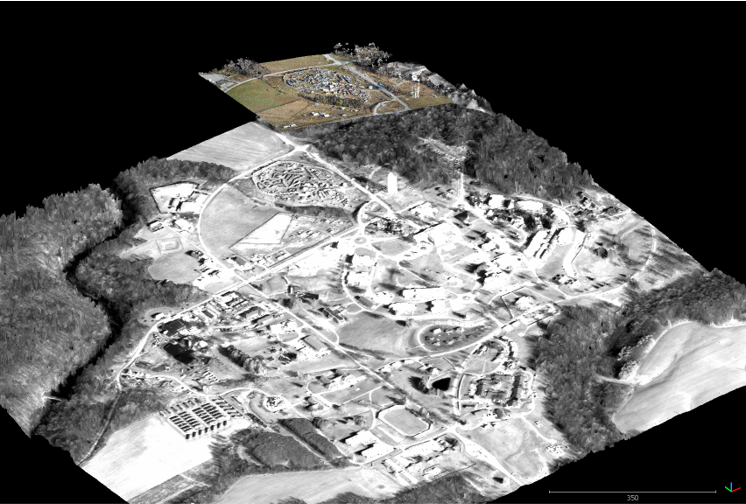
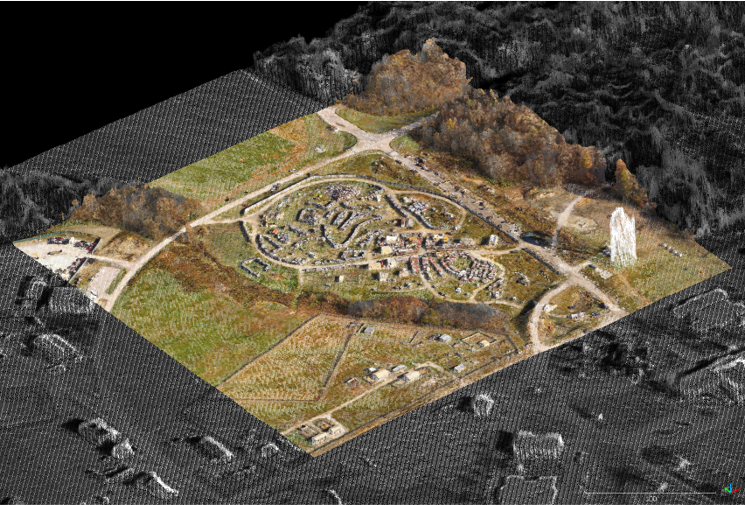

# Example

## 1. Unregistered AOI

We will register a PLY format mesh AOI to a LAZ format point cloud Foundation data source. The AOI mesh data (color) is rotated and displaced with respect to the Foundation point cloud (grayscale). The data files are found in the `demo` directory of this repository.

* Foundation file = `demo/Foundation-PointCloud.laz`
* AOI file = `demo/AOI-Mesh.ply`



## 2. Running CODEM

We will override the default setting for the pipeline minimum resolution by using the `--min_resolution` option when running `CODEM`:

```bash
$ codem demo/Foundation-PointCloud.laz demo/AOI-Mesh.ply --min_resolution 2.0
╔════════════════════════════════════╗
║               CODEM                ║
╚════════════════════════════════════╝
║     AUTHORS: Preston Hartzell  &   ║
║     Jesse Shanahan                 ║
║     DEVELOPED FOR: CRREL/NEGGS     ║
╚════════════════════════════════════╝

══════════════PARAMETERS══════════════
11:11:49 - INFO - FND_FILE = demo/Foundation-PointCloud.laz
11:11:49 - INFO - AOI_FILE = demo/AOI-Mesh.ply
11:11:49 - INFO - MIN_RESOLUTION = 2.0
11:11:49 - INFO - DSM_AKAZE_THRESHOLD = 0.0001
11:11:49 - INFO - DSM_LOWES_RATIO = 0.9
11:11:49 - INFO - DSM_RANSAC_MAX_ITER = 10000
11:11:49 - INFO - DSM_RANSAC_THRESHOLD = 10.0
11:11:49 - INFO - DSM_SOLVE_SCALE = True
11:11:49 - INFO - DSM_STRONG_FILTER_SIZE = 10.0
11:11:49 - INFO - DSM_WEAK_FILTER_SIZE = 1.0
11:11:49 - INFO - ICP_ANGLE_THRESHOLD = 0.001
11:11:49 - INFO - ICP_DISTANCE_THRESHOLD = 0.001
11:11:49 - INFO - ICP_MAX_ITER = 100
11:11:49 - INFO - ICP_RMSE_THRESHOLD = 0.0001
11:11:49 - INFO - ICP_ROBUST = True
11:11:49 - INFO - ICP_SOLVE_SCALE = True
11:11:49 - INFO - VERBOSE = False
11:11:49 - INFO - ICP_SAVE_RESIDUALS = False
11:11:49 - INFO - OUTPUT_DIR = /home/pjhartze/dev/codem/demo/registration_2021-08-05_11-11-49
══════════PREPROCESSING DATA══════════
11:11:53 - INFO - Linear unit for Foundation-PCLOUD detected as metre.
11:11:53 - INFO - Calculated native resolution for Foundation-PCLOUD as: 0.6 meters
11:11:53 - WARNING - Linear unit for AOI-MESH not detected --> meters assumed
11:11:53 - INFO - Calculated native resolution for AOI-MESH as: 0.6 meters
11:11:53 - INFO - Preparing Foundation-PCLOUD for registration.
11:11:53 - INFO - Extracting DSM from Foundation-PCLOUD with resolution of: 2.0 meters
11:12:01 - INFO - Preparing AOI-MESH for registration.
11:12:01 - INFO - Extracting DSM from AOI-MESH with resolution of: 2.0 meters
11:12:02 - INFO - Registration resolution has been set to: 2.0 meters
═════BEGINNING COARSE REGISTRATION═════
11:12:02 - INFO - Solving DSM feature registration.
11:12:05 - INFO - Saving DSM feature match visualization to: /home/pjhartze/dev/codem/demo/registration_2021-08-05_11-11-49/dsm_feature_matches.png
11:12:05 - INFO - Saving DSM feature registration parameters to: /home/pjhartze/dev/codem/demo/registration_2021-08-05_11-11-49/registration.txt
══════BEGINNING FINE REGISTRATION══════
11:12:05 - INFO - Solving ICP registration.
11:12:05 - INFO - Saving ICP registration parameters to: /home/pjhartze/dev/codem/demo/registration_2021-08-05_11-11-49/registration.txt
═════════APPLYING REGISTRATION═════════
11:12:06 - INFO - Registration has been applied to AOI-MESH and saved to: /home/pjhartze/dev/codem/demo/registration_2021-08-05_11-11-49/AOI-Mesh_registered.ply

CODEM                                  Stage: Performing Fine Registration                                   00:16
Registration Process 100%|█████████████████████████████████████████████████████████| 100/100 [00:17<00:00, 5.84/s]
$
```

Upon completion, all output, including a registered version of the AOI data file named `AOI-Mesh_registered.ply`, is saved to a new directory at the AOI file location. For this example, the new directory name is `registration_2021-08-05_11-11-49`.

## 3. Registered AOI

The registered AOI mesh overlaid on the Foundation point cloud is shown below.



## 4. Additional Examples

An unregistered point cloud AOI file and an unregistered DSM AOI file are also supplied in the `demo` directory for further experimentation/demonstration with different data types.
