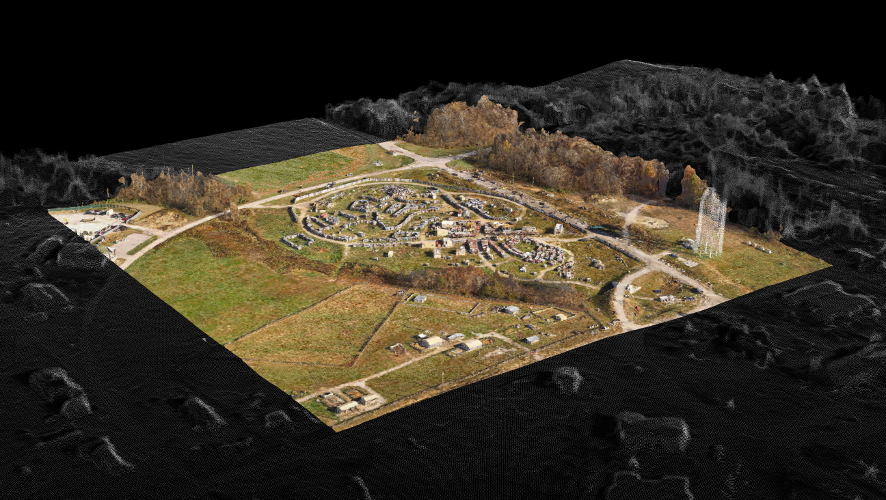

# CODEM: Multi-Modal Digital Elevation Model Registration



## Overview

`CODEM` is a testbed application for registering a 3D model of an area of interest (AOI) to a larger 3D Foundation data source. Point cloud, mesh, and raster digital surface model (DSM) data types are supported. Format support is limited to the following:

* Point Cloud: LAS, LAZ, BPF
* Mesh: PLY, OBJ
* DSM: GeoTIFF

`CODEM` follows the following basic steps to perform co-registration:

1. Generation of normalized DSMs from the AOI and Foundation data sources.
2. Coarse registration via matching of features extracted from the DSMs.
3. Fine registration via an iterative closest point (ICP) algorithm.
4. Application of the solved registration transformation to the AOI data in its original type and format.

## Installing CODEM

1. Clone the repo:

    ```console
    git clone https://github.com/NCALM-UH/CODEM
    ```

2. Create and activate a Conda environment containing the required dependencies. From inside the `CODEM` directory:

    ```console
    conda env create --file environment.yml
    ```

    ```console
    conda activate codem
    ```

3. Install `CODEM`. From the project directory.

    ```console
    pip install .
    ```

## CoRegistration

### Running CODEM

The `CODEM` application has two required positional arguments and numerous options. The required positional arguments are the file path to the Foundation data file and the file path to the AOI data file. Executing codem on the command line has the following form:

```bash
codem <foundation_file_path> <aoi_file_path> [-opt option_value]
```

For example, running `CODEM` on some of the sample data files in the [demo](demo) directory looks like:

```bash
codem demo/Foundation-PointCloud.laz demo/AOI-Mesh.ply
```

Optional arguments can be placed before or after the positional arguments. For example, we can set the minimum registration pipeline resolution to a new value (default value = 1.0):

```bash
codem demo/Foundation-PointCloud.laz demo/AOI-Mesh.ply --min_resolution 2.0
```

A summary of all options and their default values is given in the [docs/configuration.md](docs/configuration.md) document. The default option values should be sufficient for most landscapes.


## CODEM Generated Output

All output is saved to a new directory that is created at the location of the AOI file. The directory name is tagged with the date and time of execution: `registration_YYYY-MM-DD_HH-MM-SS`. The directory contents include the following:

1. Registered AOI Data File: The registered AOI file will be of the same data type and file format as the original AOI file and will have the same name with term "`_registered`" appended to end of the name.
2. `config.yml`: A record of the parameters used in the registration.
3. `log.txt`: A log file.
4. `registration.txt`: Contains the solved coarse and fine registration transformation parameters and a few statistics.
5. `dsm_feature_matches.png`: An image of the matched features used in the coarse registration step.


## Vertical Change Detection

### Running VCD

In addition to the coregistration functionality, codem provides vertical change detection functionality as well based on LiDAR scans.

```bash
vcd <before_file_path> <after_file_path> [-opt option_value]
```

### VCD Generated Output

Raster, Mesh and Point cloud outputs are generated (inclyding ESRI 3D Shapefiles) to highlight ground/not-ground features, and vertical changes.


## Additional Information

Information on available configuration options, a more in-depth review of how `CODEM` works, and a simple example utilizing data files contained in the `demo` directory of this repository are found in the `docs` directory:

* [docs/configuration.md](docs/configuration.md)
* [docs/details.md](docs/details.md)
* [docs/example.md](docs/example.md)

## Contact

* Ognyan Moore - Hobu Inc. - [Email](ogi@hobu.co)
* Preston Hartzell - University of Houston - [Email](pjhartzell@uh.edu)
* Jesse Shanahan - formerly of Booz Allen Hamilton (listed for software development credit attribution) - [LinkedIn](https://www.linkedin.com/in/jesseshanahan/)
